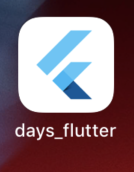
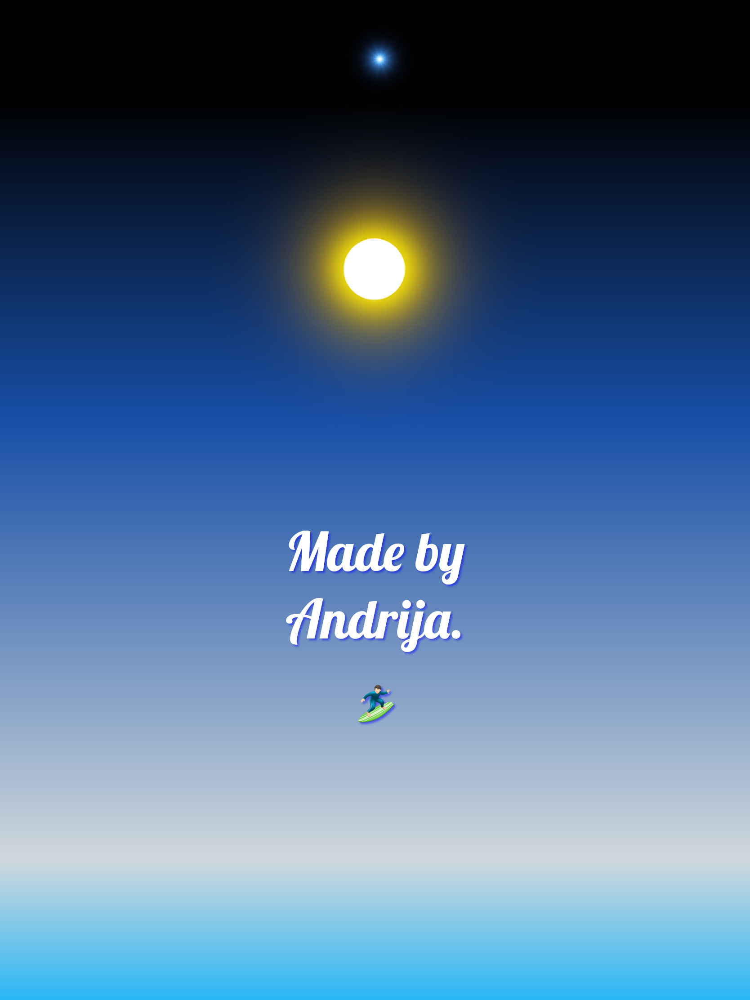
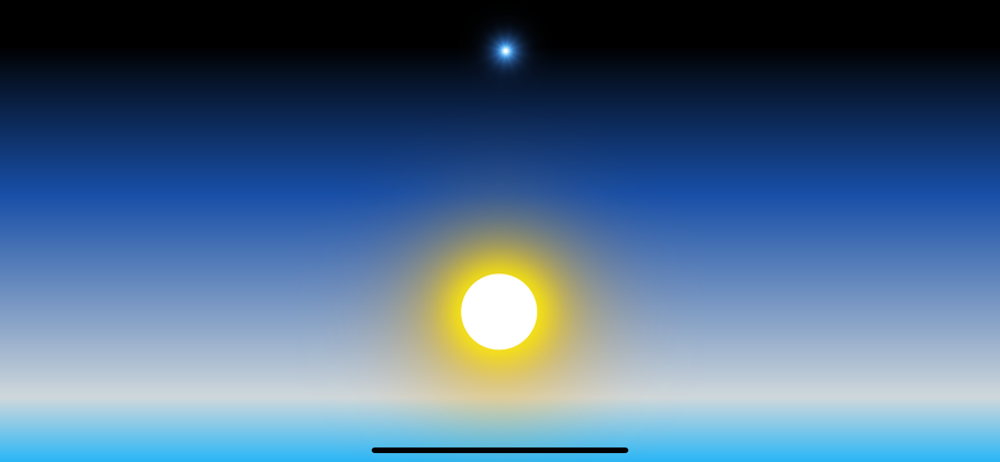
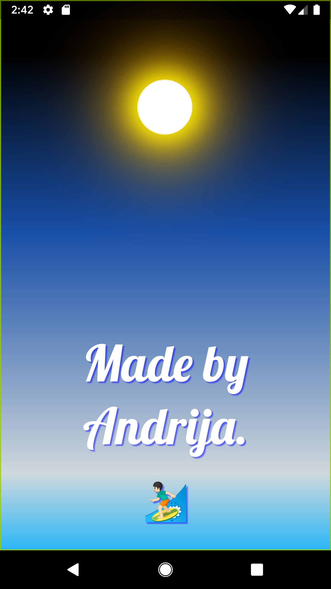
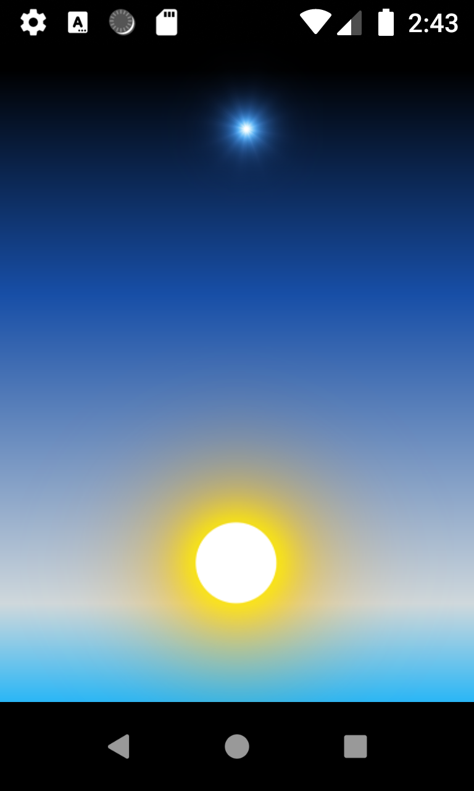

# Days Flutter App 🦋
* Called <b>Days</b> because of the Sun animation that goes around for 3 repeats/cycles.
* Google's Flutter framework 1.2 version.
* Somewhat clunky to work with, being a fairly new framework.
* Done in VS Code, simple animations of a blue star, sun and a fancy font with my favourite emoji below it.

This is the icon. ↧

More screenshots (mobile and tablet) are below the next chapter.

The GIF is of a lower quallity, had to lower the size.

## Getting Started w/ Flutter
This is a generated part of the README, a starting point for a Flutter application.

A few resources to get you started if this is your first Flutter project:

- [Lab: Write your first Flutter app](https://flutter.io/docs/get-started/codelab)
- [Cookbook: Useful Flutter samples](https://flutter.io/docs/cookbook)

For help getting started with Flutter, view our [online documentation](https://flutter.io/docs), which offers tutorials, samples, guidance on mobile development, and a full API reference.

Note: For animations I've posted a comment that has a reference to a nice article about Flutter animations, in the <b>custom_animations.dart</b> file.

#### Screenshots:
<h6>iPad Pro &#x2198;</h6>

<h6>iPhone Xr Landscape &#x2198;</h6>

<h6>Google Pixel XL &#x2198;</h6>

<h6>Android Accelerated Oreo &#x2198;</h6>

